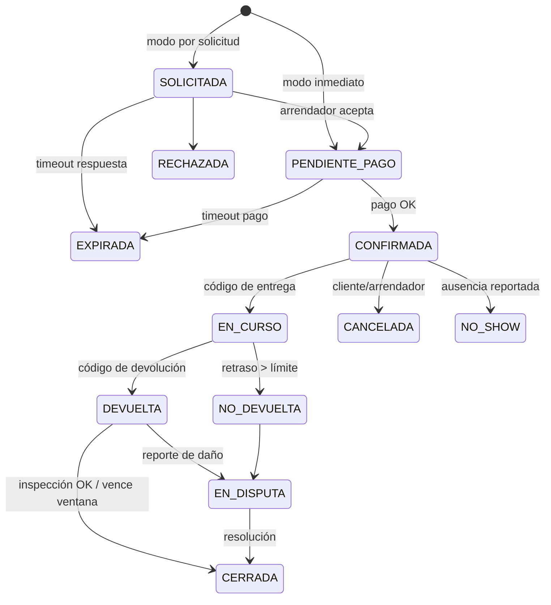
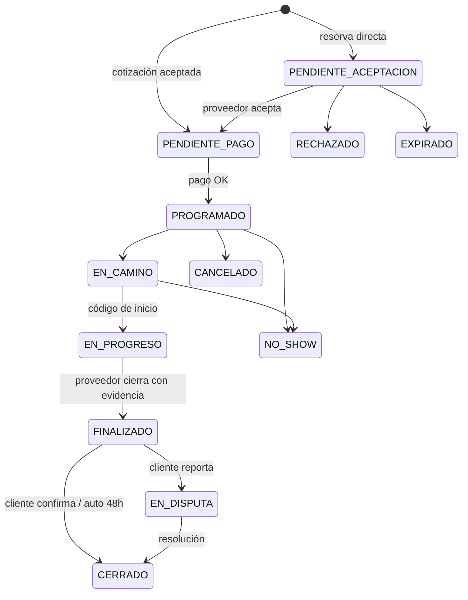

# 03 — Modelo de dominio

## Módulos (bounded contexts)
`identity` · `catalog` (categorías, oficios, ciudades/zonas) · `listings` (herramientas) ·
`providers` (perfiles de servicio, paquetes, cobertura) · `search` · `rentals` · `service-jobs`
(solicitudes, cotizaciones, trabajos) · `payments` (cobros, ledger, liquidaciones) · `deposits` ·
`messaging` · `notifications` · `reviews` · `disputes` · `admin` · `ai` (post-MVP)

Módulos de fases posteriores (docs/01), fuera del piloto: `products` (catálogo, inventario y pedidos de comercios
locales, fase 3) y `spaces` (espacios y locales, fase 3). Inmuebles y vehículos (fase 4) requieren revisión legal
antes de diseñarse. Se activan por `category.vertical` sin tocar el núcleo de identidad, pagos y disputas.

## Entidades principales
| Entidad | Campos clave |
|---|---|
| User | id, phone (único, OTP), email?, name, status, verification_level (0-3), roles[], city_id |
| IdentityVerification | user_id, type (DNI, SELFIE, ANTECEDENTES, CERTIFICADO_OFICIO, RUC), status, reviewed_by, files (privados) |
| Business | owner_user_id, ruc, razón social, tipo (ferretería, alquiladora…) — perfil comercial opcional |
| City / Zone | city (Ayacucho), zonas/distritos (Huamanga, San Juan Bautista, Carmen Alto, Jesús Nazareno, Andrés Avelino Cáceres) con polígono |
| Category | árbol; vertical (RENTAL/SERVICE en el piloto; PRODUCT/SPACE en fases futuras); attributes_schema (JSON Schema); default_commission; risk_level; enabled_cities[] |
| ToolListing | owner_id, city_id, zone_id, category_id, title, attrs, photos, replacement_value, deposit_amount, prices{hour,day,weekend,week,month}, accessories[], pickup_location (point exacto, privado), public_location (point ofuscado), public_radius_m, delivery_options, booking_mode, cancel_policy, min_verification, status, version |
| AvailabilityBlock | listing_id, period tstzrange, reason (MANUAL, BOOKING, HOLD) |
| ProviderProfile | user_id, trades[], bio, years_exp, coverage (zonas o radio), rates, packages[], weekly_availability, work_warranty_days, status |
| ServicePackage | provider_id, trade, title, description, price, price_type (FIXED/HOURLY), min_hours, duration_est |
| RentalBooking | id, listing_id, renter_id, owner_id, period, fulfillment (PICKUP/DELIVERY), price_snapshot (JSON inmutable), status, codes (handover/return, hash), timestamps por estado |
| HandoverRecord | booking_id, kind (DELIVERY/RETURN), photos, checklist, notes, confirmed_by, confirmed_at, geo_approx |
| ServiceRequest | client_id, trade, description, photos, zone, address (privada), preferred_dates, budget_ref, urgency, mode (DIRECT/QUOTE), status |
| Quote | request_id, provider_id, amount, scope, includes_materials, est_duration, valid_until, visit_fee?, status |
| ServiceJob | request_id, quote_id?/package_id?, client_id, provider_id, schedule, price_snapshot, status, start_code_hash |
| ChangeOrder | job_id, amount, reason, photos, status (PROPUESTA/APROBADA/RECHAZADA) |
| MaterialExpense | job_id, amount, receipt_photo, status |
| Payment | transaction_ref (booking/job), provider (MANUAL/MERCADOPAGO/CULQI), provider_ref, amount, status, idempotency_key |
| LedgerEntry | journal_id, account, debit, credit, currency, ref — **doble partida, inmutable** |
| Payout | beneficiary_id, amount, status, scheduled_for, provider_ref |
| Deposit | booking_id, amount, strategy, status |
| Conversation / Message | participantes, ref de transacción, texto, adjuntos, flags (contacto detectado) |
| Review | transaction_ref, author_id, target_id, role, ratings{}, comment, published_at |
| Dispute | transaction_ref, opened_by, type, claimed_amount, status, resolution, evidence[] |
| Complaint (Libro de Reclamaciones) | correlativo, datos consumidor, bien/servicio, tipo (RECLAMO/QUEJA), detalle, pedido, respuesta, plazos |
| AuditLog | actor, action, entity, entity_id, before, after, at, ip |
| OutboxEvent | aggregate, type, payload, published_at |

## Ubicación y mapa
Regla de privacidad: el mapa público nunca muestra el punto exacto (docs/05).
- **`pickup_location`** guarda el punto exacto; solo lo ven el dueño y, tras confirmar la transacción, la contraparte.
  Nunca se cachea en Redis ni se incluye en la ficha pública.
- **`public_location`** se calcula al guardar la publicación: el punto exacto se desplaza dentro de un radio fijo
  (`public_radius_m`, configurable en `platform_settings`) o se redondea. Es el que dibuja el mapa como círculo o zona y
  el que usa la búsqueda por distancia (`ST_DWithin` con índice GIST).
- El desplazamiento debe ser determinista por publicación (misma semilla), para que no se pueda promediar y recuperar el punto real.
- La ficha muestra siempre el barrio o distrito (`zone_id`) y una distancia aproximada.
- Los mismos criterios aplican a los proveedores a domicilio: se publica su zona de cobertura, no su dirección.

## Máquinas de estado

### RentalBooking


### ServiceJob


### ServiceRequest (modo cotización)
`ABIERTA → (COTIZADA) → ADJUDICADA | EXPIRADA | CANCELADA` ·
Quote: `ENVIADA → ACEPTADA | NO_SELECCIONADA | RETIRADA | VENCIDA`

### Deposit (de la propuesta v2)
`PENDIENTE → RETENIDA → LIBERADA | DEVOLUCION_PARCIAL | APLICADA_POR_DANO | EN_DISPUTA | CANCELADA`

Reglas de implementación de estados:
- Transiciones solo vía una función de dominio `transition(entity, event, actor)` que valida
  estado origen, permisos del actor y guardas; escribe `audit_log` y un `OutboxEvent` en la misma transacción.
- Timeouts implementados como jobs programados idempotentes (BullMQ), no con cron que recorre todo.
- Control de concurrencia optimista (`version`).

## Dinero
- **Cuatro conceptos que no se mezclan** (propuesta v2.0, sección 7): pago del alquiler o servicio, garantía o
  depósito, comisión de la plataforma y costos adicionales (delivery, materiales). Cada uno tiene su línea y su asiento.
  Además, el flujo de una compra de producto (fase 3) es distinto al del alquiler: el dinero de la compra nunca se
  mezcla con una garantía.
- Moneda PEN, montos en **céntimos (integer)**. Redondeo bancario solo en el cálculo final de cada línea.
- **Snapshot de precio**: al crear la reserva/trabajo se guarda el desglose completo (JSON inmutable);
  cambios posteriores de tarifa no afectan transacciones existentes.

Desglose alquiler:
```
alquiler        = f(tarifas, duración)        # elige la combinación más barata (día/semana/mes)
tarifa_servicio = alquiler × fee_cliente%
delivery        = tarifa de delivery (si aplica)
garantía        = deposit_amount               # sin comisión
TOTAL_CLIENTE   = alquiler + tarifa_servicio + delivery + garantía
comision_oferente = alquiler × comision%
LIQUIDACION_ARRENDADOR = alquiler + delivery − comision_oferente − ajustes
INGRESO_QATU    = tarifa_servicio + comision_oferente   (base imponible; IGV según asesoría contable)
```
Desglose servicio: igual, con `monto_servicio` (paquete, horas × tarifa o cotización) + órdenes de
cambio aprobadas; materiales se reembolsan sin comisión.

### Ledger de doble partida
Cuentas: `cliente:{id}:por_cobrar`, `oferente:{id}:por_pagar`, `qatu:ingresos_comision`,
`qatu:ingresos_tarifa_servicio`, `garantias:{booking}`, `pasarela:en_transito`, `reembolsos`.
Cada evento económico (cobro, captura, reembolso, liquidación, aplicación de garantía) genera un
asiento balanceado. Saldos = suma del ledger, nunca un campo mutable.

### Estrategias de pago (interfaz `PaymentGateway`)
| Adaptador | Uso | Qatu toca el dinero |
|---|---|---|
| `ManualRecorded` | Piloto: el cliente paga por Yape/efectivo al oferente; ambos confirman en la app; la comisión se factura al oferente mensualmente. | No |
| `MercadoPagoSplit` | Producción: split de pagos para marketplace (disponible en Perú). Cada oferente conecta su cuenta vía OAuth; el cobro se divide automáticamente. | No (lo divide el PSP) |
| `Culqi` (u otro PSP) | Alternativa/segundo proveedor; tarjetas + Yape/Plin. | Depende del contrato |

Liquidación: T+N días después de `CERRADA` (alquiler) o `CERRADO` (servicio), para cubrir la ventana
de disputa. Retención automática si hay disputa abierta.

### Estrategias de garantía (interfaz `DepositStrategy`)
| Estrategia | Descripción |
|---|---|
| `NONE` | Sin garantía (herramientas de bajo valor, usuarios nivel 3). |
| `RECORDED_OFFLINE` | MVP: Qatu registra monto, condiciones, evidencias y estado; el dinero se entrega en mano/Yape y se devuelve igual. Qatu actúa como registro y mediador, no como custodio. |
| `CARD_PREAUTH` | Pre-autorización en tarjeta liberada al cierre. Validar con el PSP el plazo máximo de retención y si soporta captura parcial. |
| `ESCROW_PROVIDER` | Futuro: custodia vía proveedor autorizado, previa revisión legal. |
